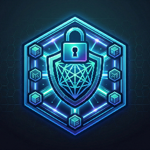

#  DistFS: Reconciling POSIX Semantics with Zero-Knowledge, Post-Quantum File Storage

DistFS is an experimental distributed, end-to-end encrypted (E2EE) file system. It is designed as a research platform to explore the boundaries of zero-knowledge privacy, strongly consistent metadata, and post-quantum cryptography (PQC) within a POSIX-compliant architecture.

> **Design Documentation:** For a comprehensive technical deep-dive into the architecture and security model, refer to the [DISTFS.md](DISTFS.md) living design document.

The core tension DistFS resolves is the fundamental incompatibility between high-fidelity POSIX environments and a zero-knowledge model. POSIX file systems require complex, dynamic metadata manipulation—such as granular Access Control Lists (ACLs), atomic renames, hierarchical directory traversal, and distributed locking. Conversely, a zero-knowledge model mandates that the server infrastructure remains mathematically blind to the data payload and structural filenames.

Note: While DistFS ensures data and filenames are cryptographically opaque, the server explicitly manages a **Social Metadata Graph** (Group memberships and ACL identifiers) to enforce POSIX semantics. This represents a deliberate trade-off where organizational structure is observable by the infrastructure to enable complex sharing.

DistFS bridges this gap. We invite researchers, cryptographers, and systems engineers to review the architecture, attempt to break the cryptographic provenance, and contribute to the evolution of post-quantum distributed storage.

---

## 1. Threat Model & Security Assumptions

DistFS abandons the standard "Honest-but-Curious" model in favor of an aggressive Byzantine threat model, often summarized as preparing for "Harvest Now, Decrypt Later" attacks.

*   **Hostile Infrastructure:** We assume the entire backend infrastructure is fundamentally compromised. This includes physical data center networks, load balancers, and the storage nodes themselves. The metadata servers are considered actively hostile and capable of attempting to forge file ownership, inject malicious payloads, or roll back state.
*   **The Trusted Boundary:** The client machine (specifically, the DistFS client library, FUSE mount, or WASM-powered Web Client) represents the *only* trusted boundary in the system. All encryption, decryption, access-control matrix expansions, and cryptographic verifications occur exclusively within this boundary.
*   **Out of Scope:** Endpoint compromise (e.g., malware or rootkits installed directly on the user's laptop) is out of scope. If the client machine's memory is compromised, the keys are compromised. Similarly, absolute physical denial of service (e.g., a rogue administrator intentionally deleting all hard drives) cannot be prevented by cryptography alone.

---

## 2. Key Cryptographic Mechanisms (Architectural Differentiators)

To survive in a hostile environment while providing a standard UNIX-like experience, DistFS introduces several novel architectural mechanisms.

### 2.1 Post-Quantum Cryptography (PQC) at Layer 7 (Sealing)
Modern enterprise infrastructure heavily relies on Transport Layer Security (TLS). However, TLS is almost universally terminated at an ingress proxy or load balancer, leaving the payload as plaintext as it traverses the internal data center network. 

**The Mechanism:** DistFS bakes NIST-standardized PQC (FIPS 203/204) directly into the application layer. Every Remote Procedure Call (RPC) mutation is constructed as a **Sealed Request**. The client queries the cluster for its active, periodically rotating **ML-KEM-768** (FIPS 203) Epoch Key. The client encapsulates a shared secret, encrypts the entire JSON RPC payload using AES-256-GCM, and cryptographically signs the envelope using its own **ML-DSA-65** (FIPS 204) identity key. 

**Replay Protection:** Every sealed request includes a high-resolution UTC timestamp. The server maintains a sliding-window cache (default 2 minutes) to detect and reject replayed requests, providing robust protection against network-level interception.

**The Benefit:** Intermediate infrastructure (proxies, WAFs, internal networks) cannot observe, intercept, or manipulate the metadata layer. The system is immune to "Harvest Now, Decrypt Later" attacks, as the transport layer is rendered irrelevant to payload security.

### 2.2 Zero-Knowledge POSIX ACLs (The Lockbox)
Providing granular POSIX.1e Access Control Lists (ACLs) in an E2EE file system is exceptionally difficult because mapping standard kernel permissions to complex cryptographic key distribution requires the server to understand who is allowed to read what.

**The Mechanism:** DistFS maps standard Linux FUSE xattrs (`system.posix_acl_access` and `system.posix_acl_default`) directly into a dynamic cryptographic structure called the "Lockbox." 
When a user executes `setfacl -m u:alice:rwx file.txt`, the FUSE daemon intercepts the kernel's binary xattr request. The client parses this, fetches Alice's public PQC key from the registry, locally decrypts the file's symmetric AES-256-GCM `File Key`, re-encrypts it specifically for Alice's **ML-KEM** public key, and appends this new ciphertext to the file's Lockbox. The client then generates a new **ML-DSA** signature over the updated ACL state. 


**The Benefit:** The server strictly enforces the POSIX mask algorithm for write authorizations, but it remains mathematically blind to the actual file data. DistFS achieves high-fidelity POSIX ACL interoperability natively through FUSE while preserving true end-to-end encryption.

### 2.3 The Web Client: WASM-Powered Zero-Knowledge
To bring the DistFS security model to the browser, we utilize **WebAssembly (WASM)** and **Service Workers** to maintain the "Trust No One" mandate.

**The Mechanism:** The entire DistFS client logic—including PQC signature generation, AES-GCM chunk decryption, and Raft metadata management—is compiled to WASM. 
*   **Decryption-on-the-Fly:** When you view a file in the Web Client, a **Service Worker** intercepts the fetch request. It streams encrypted chunks from the storage node, sends them into the WASM worker for decryption, and pipes the plaintext back to the browser using `ReadableStream`.
*   **Secure Context Seeking:** The streaming engine supports `Range` headers, enabling native browser media players to seek through multi-gigabyte encrypted videos without loading the entire file into memory.

**The Benefit:** The browser acts as a secure, stateless terminal. Plaintext data and private keys exist only within the WASM memory space and are never transmitted to the server or stored in persistent browser caches.

### 2.4 The "Dark Registry" and OOB Governance
Enterprise file systems typically ingest plaintext Personally Identifiable Information (PII) like emails, full names, or LDAP attributes into their internal databases, creating massive privacy liabilities.

**The Mechanism:** DistFS utilizes a **Dark Registry**. User identities are derived from an irreversible hash: `HMAC-SHA256(sub_claim, ClusterSecret)`. The server only ever stores and operates on opaque cryptographic UUIDs.
**The Privacy Boundary:** While the live cluster requires the `ClusterSecret` to function (and could thus deanonymize users via dictionary attacks), this mechanism provides robust **Defense-in-Depth against Offline Leakage**. A stolen database snapshot contains zero plaintext PII and cannot be reverse-engineered without the heavily guarded master secret.

Furthermore, successfully authenticating via Single Sign-On (SSO/OIDC) does *not* grant network access. DistFS enforces a strict Zero-Trust onboarding model requiring an Out-Of-Band (OOB) cryptographic handshake. When a new device registers, its account is marked as `Locked`. The client generates a random 6-digit PIN. An existing Administrator must manually verify this PIN (e.g., over a phone call or in person) and sign a blockchain-style attestation to unlock the account. 
**The Benefit:** Eradicates Sybil attacks where an adversary registers thousands of identities, and guarantees that offline database exfiltration leaks zero PII.

### 2.5 The Sovereign Chain of Trust
To ensure the integrity of the zero-knowledge model even if the server is compromised, DistFS implements a decentralized, sovereign chain of trust.

**The Mechanism:**
*   **Sovereign Bootstrap:** The first user to register with a cluster becomes the **Identity Anchor**. They create the root inode (`/`) and provision the foundational system groups.
*   **Cryptographic Binding:** Every file ID is cryptographically bound to its owner's identity via hashing (`ID = Hash(OwnerID || Nonce)`). This prevents a compromised server from silently "swapping" file ownership in the database.
*   **Aggregate Optimistic Verification:** The client library utilizes an asynchronous verification model. It provisionally allows operations using server-provided keys while simultaneously verifying those keys against signed attestations in the `/registry` in the background.
*   **Root Identity Pinning (TOFU):** Upon the first successful mount, the client pins the Root Owner's public key in its local configuration, providing Trust-On-First-Use protection against cluster hijacking.

**The Benefit:** Ensures that mathematical truth (signatures and hashes) always overrides the server's database claims, making the system resilient to total infrastructure compromise.

---

## 3. POSIX Fidelity & Performance Mitigations

Operating a deeply encrypted file system over a network introduces significant latency hurdles. DistFS implements advanced mitigations to provide near-native performance.

### 3.1 Differential Synchronization (Fsync)
Standard cloud drives often force a full re-upload of a file upon save. In a FUSE environment where applications frequently call `fsync`, this is untenable.
**Solution:** The DistFS client locally tracks "dirtied" 1MB pages in memory. Upon an `fsync` call, only the modified chunks are re-encrypted and uploaded. The client then submits an atomic Raft transaction to update the Inode's chunk manifest, replacing only the pointers to the modified regions.

### 3.2 Mitigating Tail Latency via Hedged Reads
In distributed storage, the 99th percentile response time often dictates the overall speed of sequential reads.
**Solution:** DistFS implements **Hedged Requests**. When fetching a chunk, the client queries the primary replica. If the primary does not respond within a strict sub-second threshold (or returns an error), the client fires parallel, staggered requests to secondary replicas. The first successful response cancels the remaining network operations, effectively smoothing out tail latency.

### 3.3 Zero-Cost O(1) Caching
To manage the heavy CPU burden of ML-DSA signature verification and deep directory traversal, DistFS implements extreme in-memory caching.
**Solution:** The client utilizes bounded LRU caches for signature math, `sync.Pool` allocations for 1MB cryptographic buffers to eliminate Garbage Collection spikes, and O(1) reverse indices for immediate PathCache invalidation. Background FUSE pre-fetching is tightly throttled using sequential-read heuristics to prevent bandwidth waste during random I/O seeks.

---

## 4. System Architecture

DistFS employs a unified node architecture where a single Go binary (`storage-node`) performs both metadata and data storage roles based on configuration.

1.  **Metadata Role:** 3-5 nodes run a strongly consistent BoltDB-backed Raft FSM, managing Inodes, distributed leases, and the Dark Registry.
2.  **Data Role:** All nodes in the cluster participate in an eventually consistent, parallel fan-out storage pool handling the 1MB encrypted data chunks.

**Hardware-Bound Security (TPM):** For maximum local security, storage nodes can be configured to bind their Master Keys to a **TPM 2.0** (Trusted Platform Module) using `/dev/tpmrm0`. This ensures the filesystem cannot be unsealed if the disk is moved to a different machine.

```text
Client (FUSE / Web) <-- Sealed JSON / PQC --> Metadata Cluster (Raft)
      |                                             |
      +------- Encrypted Chunks ------------------- + --> Data Node Pool
```

---

## 5. Give It a Try (User Manual)

For detailed specifications of the wire protocol and high-level client library, refer to the [SERVER-API.md](SERVER-API.md) and [CLIENT-API.md](CLIENT-API.md) source-of-truth documents.

We encourage you to deploy a local test cluster and experiment with the system. 

### 5.1 Prerequisites
*   **Operating System:** Linux (kernel support for FUSE 3 required).
*   **Hardware:** TPM 2.0 (optional, for `--use-tpm` security).
*   **Software:** `fuse3`, `libfuse3-dev`, and `acl` (for setfacl testing) installed locally.
*   **Environment:** Go 1.25 or higher for building from source.

### 5.2 Installation
Clone the repository and build the core binaries:
```bash
git clone https://github.com/c2FmZQ/distfs.git
cd distfs
go build ./cmd/distfs
go build ./cmd/distfs-fuse
go build ./cmd/storage-node
```

### 5.3 Spin Up a Local Cluster
You can quickly bootstrap a single-node testing cluster using a local master key for at-rest disk encryption:
```bash
# This key derives the at-rest encryption for the local BoltDB and chunks.
export DISTFS_MASTER_KEY="local-dev-secret"
./storage-node --id local-1 --bootstrap --api-addr :8080 --raft-bind :8081
```

### 5.4 The Unified Onboarding Flow
DistFS streamlines client initialization by integrating identity generation, OIDC authentication, and secure configuration backup.

**Initialize a new account (This will prompt you for an OIDC token if configured):**
```bash
./distfs init --new --server http://localhost:8080
```

*Note: In a fully secured cluster, an Administrator must unlock your account before you can store data.*

### 5.5 CLI Command Reference
The `distfs` binary provides a set of tools for manual interaction with the encrypted file system without mounting FUSE.

*   **Namespace Operations:**
    *   `./distfs ls <path>`
    *   `./distfs mkdir <path>`
    *   `./distfs rm <path>`
*   **Data Operations:**
    *   `./distfs put [-f] <local_file> <remote_path>` (use `-f` to overwrite preserving metadata)
    *   `./distfs get <remote_path> <local_file>`

### 5.6 FUSE Integration (POSIX Testing)
Mount the encrypted filesystem directly to your local OS to test POSIX behavior, including ACLs and differential sync.

```bash
mkdir ~/my-distfs
./distfs-fuse -mount ~/my-distfs
```

### 5.7 Automated E2E Testing
DistFS includes a comprehensive, containerized E2E test suite that exercises the Raft cluster, FUSE client, and Web Client (via Playwright).

```bash
# Run all tests (Unit, FUSE, Web E2E, Benchmarks)
./scripts/run-tests.sh

# Run only E2E tests and capture UI screenshots
./scripts/run-tests.sh --fast --screenshots
```
*Screenshots will be automatically generated in `docs/assets/`.*

---

## 6. Feedback and Contributions

DistFS is an active research project. We are constantly looking to improve the cryptographic models, performance heuristics, and architectural security. 

*   **Security Audits:** If you find a flaw in the cryptographic provenance, Lockbox expansion, or sealing algorithms, please open an issue.
*   **Performance:** DistFS includes significant GC and latency optimizations (`sync.Pool`, O(1) indices). We welcome benchmarking data and PRs for further zero-copy network paths.
*   **Contributions:** Pull requests are highly encouraged. Please ensure all modifications pass the rigorous test suite: `./scripts/run-tests.sh`.

---

## License

Copyright 2026 TTBT Enterprises LLC. Licensed under the Apache License, Version 2.0.
