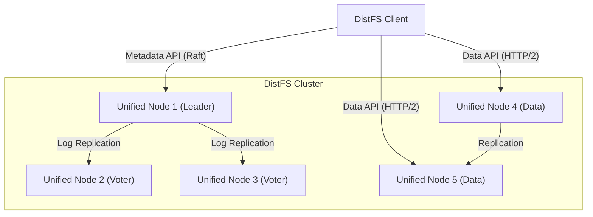
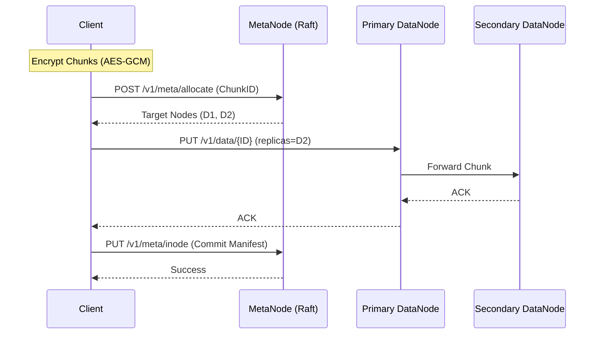
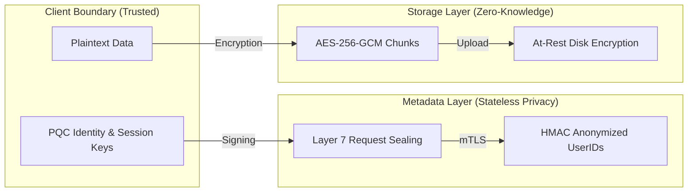

# DistFS

DistFS is a distributed, end-to-end encrypted file system designed with a "trust-no-one" security model. It provides a strongly consistent namespace via Raft consensus and a scalable data layer for sharded chunk storage. 

The primary goal of the project is to ensure that storage providers have zero knowledge of the user's data or the file system structure.

## Core Principles

*   **Privacy by Default:** All file content and metadata (including filenames and directory structures) are encrypted on the client side before being sent to the cluster.
*   **Zero-Knowledge:** The server never sees plaintext data or encryption keys. Access control is enforced cryptographically.
*   **Strong Consistency:** Metadata operations are managed by a Raft consensus group to ensure a global, consistent view of the file system.
*   **Availability:** Data is sharded into fixed-size chunks and replicated across multiple nodes to protect against hardware failures.
*   **Quantum Readiness:** Identity and key encapsulation rely on Post-Quantum Cryptography (PQC) algorithms.

## Architecture

DistFS utilizes a unified node architecture where each node can perform two roles:
1.  **Metadata Role:** Participates in the Raft group to manage inodes and directories.
2.  **Data Role:** Stores encrypted binary blobs (chunks). Chunks are content-addressed by the hash of their encrypted content.



### Data Flow (Write)

When a user writes a file, the client handles the heavy lifting to maintain zero-knowledge privacy.



## Security Model

DistFS employs a defense-in-depth strategy to protect user privacy.



*   **Layer 7 E2EE (Sealing):** All metadata requests and responses are wrapped in encrypted envelopes, protecting against inspection by intermediate proxies or load balancers.
*   **Identity:** User identities are based on PQC sign/encrypt key pairs. User IDs are anonymized using a cluster-wide HMAC secret.
*   **At-Rest Encryption:** Nodes leverage `github.com/c2FmZQ/storage` to encrypt all local data (logs, snapshots, and chunks) using a node-local master key.
*   **Multi-Device Sync:** Users can securely synchronize their configuration across devices using a passphrase-encrypted recovery blob stored on the server.

## Getting Started

### Prerequisites

*   Linux environment
*   Go 1.25+
*   `fuse3` and `libfuse3-dev` (for FUSE support)
*   Docker and Docker Compose (for testing)

### Installation

```bash
git clone https://github.com/c2FmZQ/distfs.git
cd distfs
go build ./cmd/...
```

### Running a Cluster

1.  **Configure the Master Key:**
    Every node requires a master passphrase to manage its local encryption.
    ```bash
    export DISTFS_MASTER_KEY="your-node-secret"
    ```

2.  **Start the First Node (Bootstrap):**
    ```bash
    ./storage-node --data-dir ./data/n1 --api-addr :8080 --bootstrap --oidc-discovery-url https://example.com/.well-known/openid-configuration
    ```

3.  **Join Additional Nodes:**
    ```bash
    ./storage-node --data-dir ./data/n2 --api-addr :8081 --raft-bind :8082 --cluster-addr :9091 --oidc-discovery-url https://example.com/.well-known/openid-configuration
    # Use the admin API or dashboard to join the node to the cluster.
    ```

## Usage

### 1. Unified Onboarding
DistFS simplifies setup by combining identity generation, OIDC registration, and cloud-backed recovery into a single command. Endpoints for authentication are discovered automatically from the metadata server.

#### New Account
Generate your local PQC identity and register with the cluster in one step.
```bash
# Uses OAuth2 Device Flow by default
./distfs init --new -server http://localhost:8080
```
The client will prompt for a passphrase to encrypt your local configuration and automatically store a recovery blob on the server. (Optional: `-client-id <id>` if your cluster uses a custom OIDC client ID).

#### Existing Account (New Device)
Restore your identity on a new device using your OIDC credentials and passphrase.
```bash
./distfs init -server http://localhost:8080
```
(Optional: `-client-id <id>` if your cluster uses a custom OIDC client ID).

### 2. File Operations
Once initialized, you can use standard file operations.
```bash
# Create a directory
./distfs mkdir /documents

# Upload a file
./distfs put local-file.txt /documents/remote-file.txt

# List files
./distfs ls /documents

# Download a file
./distfs get /documents/remote-file.txt restored.txt
```

### 3. FUSE Mounting
Standard OS integration is provided via FUSE. If no configuration is found, `distfs-fuse` will automatically trigger the onboarding flow.
```bash
mkdir ~/distfs-mount
./distfs-fuse -mount ~/distfs-mount
```

## Development and Acknowledgments

DistFS is actively maintained and tested. The implementation relies on a robust CI suite covering unit tests and complex E2E failure simulations.

This project was built and is maintained with extensive use of the **Gemini CLI**, an AI-powered engineering tool. The AI assisted in architectural design, implementation of cryptographic logic, and the development of the comprehensive test suite.

## License

Copyright 2026 TTBT Enterprises LLC. Licensed under the Apache License, Version 2.0.
