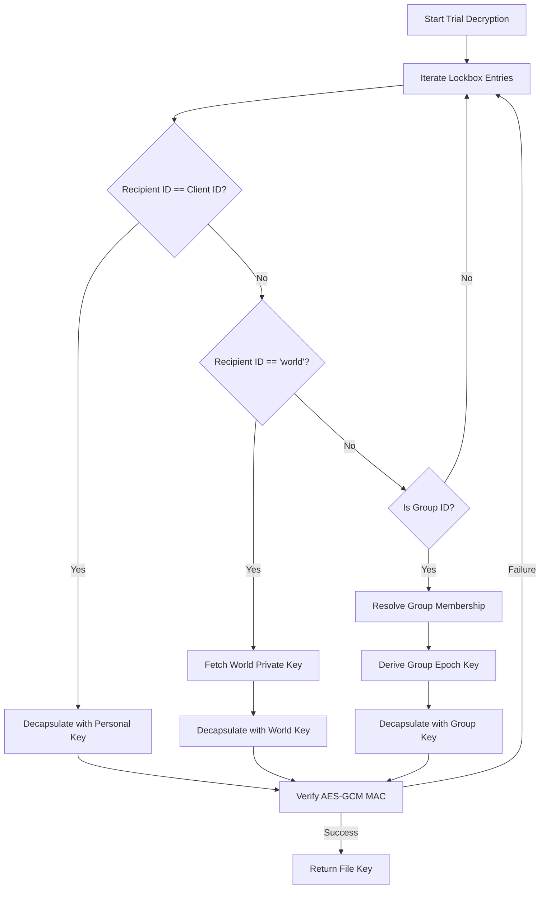
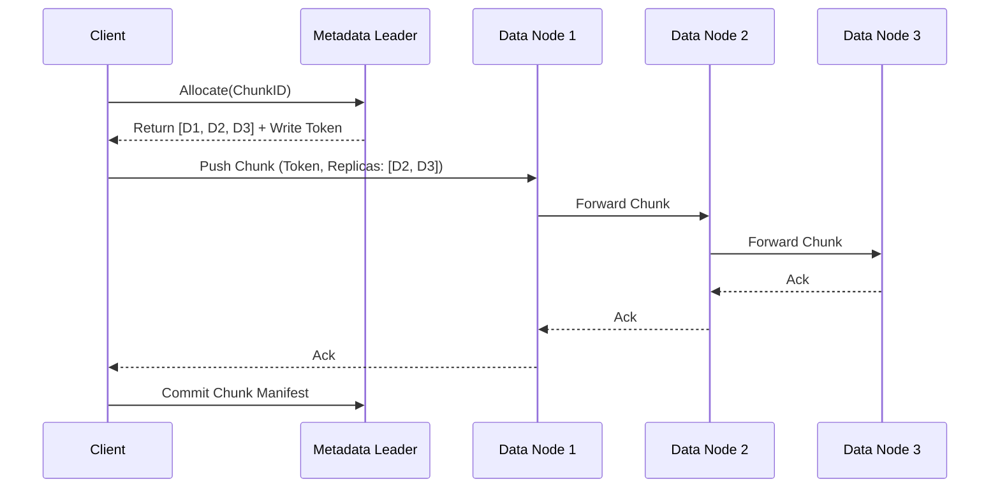

# DistFS Filesystem Operations & Cryptography

This document provides an analysis of the DistFS filesystem architecture. It details the strict separation of responsibilities between the untrusted server and the cryptographic client, the establishment of trust, and the execution of cryptographic protocols.

## 1. Separation of Responsibilities

DistFS operates under a strict "Trust No One" model. The server infrastructure is treated as an untrusted persistence and coordination layer.

### 1.1 Server Responsibilities
*   **Metadata Enforcement:** The server maintains the file system graph via Raft, enforcing referential integrity (e.g., preventing directory loops, ensuring correct link counts).
*   **Concurrency Control:** The server utilizes Optimistic Concurrency Control (OCC) via incremental versioning and provides strict linearizability through lease management.
*   **Resource Management:** The server enforces multi-tenant quotas (Inodes and Bytes) at the User and Group levels, dynamically resolving the primary debtor based on the `QuotaEnabled` flag.
*   **POSIX Semantics:** The server manages open file handles, usage leases, and deferred deletions to ensure high-fidelity POSIX compliance (e.g., unlinked files remain on disk until all handles are closed).

### 1.2 Client Responsibilities
*   **Data Encryption:** All file content and sensitive metadata (filenames, symlink targets) are encrypted by the client before transmission.
*   **Data Chunking:** The client splits file data into uniform 1MB chunks, handling necessary padding to obfuscate exact file sizes.
*   **Authorization:** Access control is entirely cryptographic. The client encapsulates symmetric keys using Post-Quantum asymmetric algorithms (ML-KEM) and signs metadata mutations (ML-DSA) to prove authorization.

## 2. Establishing Trust

Trust in DistFS is established without reliance on centralized Certificate Authorities, using a self-sovereign, recursive model.

### 2.1 Sovereign Bootstrap
The cluster is anchored by the first registered user ("Alice").
1.  Alice generates a Post-Quantum Cryptography (PQC) identity (ML-KEM encapsulation keys and ML-DSA signing keys).
2.  Alice registers with the cluster and is automatically granted administrative rights.
3.  Alice initializes the filesystem root (`/`) and system namespaces (`/registry`, `/users`).
4.  She creates her own self-signed attestation file (`/registry/alice.user`), establishing the root of the Sovereign Chain of Trust.

### 2.2 Optimistic Verification
To prevent blocking I/O operations while verifying identity attestations in the distributed `/registry`, DistFS uses Aggregate Optimistic Verification.

1.  **Optimistic Phase:** As the client traverses the file system (e.g., during `Open`), it fetches Inodes and verifies their ML-DSA signatures using public keys provided by the server. It proceeds optimistically, queuing the `SignerID` and `OwnerID` for later verification.
2.  **Confirmation Phase:** Once the critical path is resolved, the client asynchronously fetches the registry attestations (e.g., `/registry/<ID>.user`) for all queued IDs. It verifies the attestation signatures against the trusted anchor (Alice) or previously verified intermediaries.
3.  **Cross-Check:** The client ensures the public keys used in the Optimistic Phase exactly match the keys bound in the verified registry attestations. Failure immediately aborts the operation and marks the data as tainted.

## 3. Cryptographic Operations

DistFS employs a defense-in-depth cryptographic strategy, protecting data in transit, at rest, and against metadata tampering.

### 3.1 Layer 7 End-to-End Encryption (E2EE)
To prevent network infrastructure (proxies, load balancers) from analyzing traffic patterns, all metadata mutations are encapsulated in Layer 7 E2EE.
*   Requests are packaged as a `SealedRequest`.
*   The payload is a `SealedEnvelope` encrypted using an ephemeral symmetric key, which is itself encapsulated for the cluster's active, rotating **Epoch Key** (ML-KEM).
*   Responses are `SealedResponse` envelopes, symmetrically encrypted for the client.
*   Replay attacks are mitigated via high-resolution timestamps and sliding-window nonces within the sealed envelopes.

### 3.2 Data Encryption (ClientBlobs and Chunks)
*   **AES-256-GCM:** The standard for symmetric encryption in DistFS.
*   **ClientBlobs:** Sensitive Inode metadata (filename, `MTime`, POSIX ACLs) is serialized and encrypted into an opaque `ClientBlob` using a unique **File Key**.
*   **Chunks:** File data is chunked and encrypted. The chunk ID is the cryptographic hash of the *encrypted* chunk, providing content-addressability.

### 3.3 Trial Decryption Algorithm
When a client needs to access a file, it must derive the File Key from the Inode's `Lockbox`. The Lockbox contains the File Key encrypted for various authorized recipients.

1.  The client iterates over all entries in the `Lockbox`.
2.  If an entry targets the user's explicit ID, they decapsulate it directly using their ML-KEM private key.
3.  If it targets a Group, the client must first decrypt the Group's `Lockbox` to obtain the Group's symmetric **Epoch Key**, which is then used to decrypt the Inode's Lockbox entry.

### 3.4 Group Lockboxes & Forward Secrecy
Groups utilize rotating **Epoch Keys** to manage access.
*   When a user is added to a group, the current Epoch Key is encapsulated for their public key and added to the group's Lockbox.
*   If a user is removed, the Epoch Key is rotated. The new key is encapsulated *only* for the remaining members.
*   This ensures forward secrecy: a removed member cannot decrypt newly created files within the group.

## 4. Chunk Distribution and Data Nodes

Data nodes provide scalable, horizontal persistence for encrypted chunks.

1.  **Allocation:** The client asks the Metadata Leader to allocate space for a new `ChunkID`. The Leader returns a set of target Data Nodes based on consistent hashing and available capacity.
2.  **Pipelined Replication:** The client pushes the encrypted chunk to the primary Data Node. The primary forwards it to the secondary, which forwards it to the tertiary.
3.  **Capability Tokens:** Data nodes enforce access control via short-lived, signed Capability Tokens issued by the Metadata Leader. The client must present a valid token to read or write a specific `ChunkID`.

## 5. Cryptography Proof for the Trust Model

The trust model in DistFS relies on a self-sovereign chain of trust rooted at the initial user (Alice) and propagated through verifiable attestations. We define the security of this model using a game-based approach.

### 5.1 Definitions

Let $\mathcal{U}$ be the set of all identities in the system.
Let $PK_u$ and $SK_u$ denote the public and private keypair (ML-DSA) for user $u \in \mathcal{U}$.
Let $A(u, v)$ denote an attestation where user $u$ signs the public key of user $v$.
Let $\mathcal{T}$ be the set of trusted users. Initially, $\mathcal{T} = \{Alice\}$.

### 5.2 The Trust Game

**Setup:** The challenger generates $(PK_{Alice}, SK_{Alice})$ and publishes $PK_{Alice}$.
**Queries:** The adversary $\mathcal{A}$ can query the following oracles:
1.  **Register(u):** The challenger generates keys for a new user $u$ and returns $PK_u$.
2.  **Attest(u, v):** If $u \in \mathcal{T}$, the challenger returns a valid attestation $A(u, v) = Sign(SK_u, PK_v)$.

**Challenge:** The adversary outputs a forged attestation $A^*(Alice, w)$ for some user $w$ not previously queried to the Attest oracle with $u=Alice$.

### 5.3 Security Theorem

**Theorem 1:** If the underlying signature scheme (ML-DSA) is Existentially Unforgeable under Chosen Message Attack (EUF-CMA), then the DistFS trust model is secure against unauthorized identity spoofing.

**Proof (Sketch):**
Assume there exists an adversary $\mathcal{A}$ that can win the Trust Game with non-negligible advantage $\epsilon$. We construct a reduction $\mathcal{B}$ that uses $\mathcal{A}$ to break the EUF-CMA security of ML-DSA.

1.  $\mathcal{B}$ receives a public key $PK^*$ from the ML-DSA challenger.
2.  $\mathcal{B}$ sets $PK_{Alice} = PK^*$ and starts $\mathcal{A}$.
3.  When $\mathcal{A}$ queries **Register(u)**, $\mathcal{B}$ acts honestly, generating and storing $(PK_u, SK_u)$.
4.  When $\mathcal{A}$ queries **Attest(Alice, v)**, $\mathcal{B}$ forwards the request $PK_v$ to its ML-DSA signing oracle and returns the resulting signature to $\mathcal{A}$.
5.  When $\mathcal{A}$ queries **Attest(u, v)** for $u \neq Alice$, $\mathcal{B}$ uses its stored $SK_u$ to generate the signature.
6.  Eventually, $\mathcal{A}$ outputs a forged attestation $A^*(Alice, w) = \sigma^*$.

Since $\mathcal{A}$ wins the Trust Game, $\sigma^*$ is a valid signature on $PK_w$ under $PK_{Alice}$ (which is $PK^*$). Furthermore, since $w$ was not queried to the Attest oracle for $Alice$, $\mathcal{B}$ never queried its signing oracle for $PK_w$.
Therefore, $\mathcal{B}$ successfully outputs a valid forgery $(PK_w, \sigma^*)$, breaking the EUF-CMA security of ML-DSA with advantage $\epsilon$.

Since we assume ML-DSA is EUF-CMA secure, $\epsilon$ must be negligible, proving the theorem.

### 5.4 Data Integrity Proof (Formal)

**Theorem 2:** If the underlying authenticated encryption scheme (AES-GCM) provides Authenticated Encryption with Associated Data (AEAD) and is unforgeable, the cryptographic hash function provides Second Preimage Resistance (SPR), and the signature scheme (ML-DSA) is Existentially Unforgeable under Chosen Message Attack (EUF-CMA), then the integrity of DistFS file data is preserved against malicious tampering.

**Proof (Sketch):**
Let a file $F$ consist of a sequence of chunks $c_1, c_2, \dots, c_n$.
The encryption of a chunk using symmetric key $k$ and a unique nonce $N_i$ is $E_k(N_i, c_i) = (C_i, T_i)$ where $C_i$ is the ciphertext and $T_i$ is the authentication tag. (We assume $N_i$ is never reused for a given $k$).
The ChunkID is derived as $ID_i = H(N_i || C_i || T_i)$, where $H$ is a cryptographic hash function with Second Preimage Resistance.
The Inode contains the manifest $M = [ID_1, ID_2, \dots, ID_n]$ and is signed by the owner's ML-DSA private key as $\sigma_M = Sign(SK_{owner}, M)$.

Assume an adversary $\mathcal{A}$ attempts to modify a chunk without detection. $\mathcal{A}$ must present a modified chunk $c_i^*$ such that the system accepts it as valid.

There are three avenues for $\mathcal{A}$:
1.  **Modify the ciphertext/tag directly:** $\mathcal{A}$ creates $(C_i^*, T_i^*) \neq (C_i, T_i)$. For this to be accepted during decryption, the AEAD verification must succeed. By the AEAD unforgeability property of AES-GCM, producing a valid $(C_i^*, T_i^*)$ for any modified data without the key $k$ happens with negligible probability. *Note: Even if $\mathcal{A}$ compromises $k$ and forges a valid $(C_i^*, T_i^*)$, it will produce a new $ID_i^*$ that does not match the signed manifest, making AEAD a defense-in-depth layer here.*
2.  **Find a second preimage:** $\mathcal{A}$ finds a different, validly encrypted chunk $(N_i', C_i', T_i')$ that hashes to the exact same $ID_i$. That is, $H(N_i' || C_i' || T_i') = H(N_i || C_i || T_i)$. Since $H$ is assumed to possess Second Preimage Resistance, the probability of $\mathcal{A}$ finding such a match is negligible.
3.  **Modify the Inode Manifest:** $\mathcal{A}$ creates a new chunk with a new hash $ID_i^*$, and updates the manifest $M^*$ to include $ID_i^*$. For $M^*$ to be accepted by the system, $\mathcal{A}$ must provide a valid signature $\sigma_{M^*} = Sign(SK_{owner}, M^*)$. As shown in Theorem 1, the EUF-CMA security of ML-DSA means the probability of forging this signature without $SK_{owner}$ is negligible.

Since all possible avenues for $\mathcal{A}$ to violate data integrity require breaking the security of the underlying cryptographic primitives (which are assumed secure), the probability of $\mathcal{A}$ succeeding is negligible. Thus, data integrity is preserved.

**Known Weakness: Replay / Rollback Attacks (Stale Manifests)**
This proof demonstrates that an adversary cannot forge a *new* manifest. However, it does not prevent an adversary (or a malicious metadata server) from replacing the current file state with an *older, previously valid* manifest and its valid signature $\sigma_M$. Because the old signature remains cryptographically valid under $SK_{owner}$, the client will accept it, rolling back the file to a previous state.
*TODO: The DistFS implementation must be updated to incorporate a monotonic version number within the Inode signature that the client verifies against a strictly linearizable registry to explicitly prevent rollback attacks.*