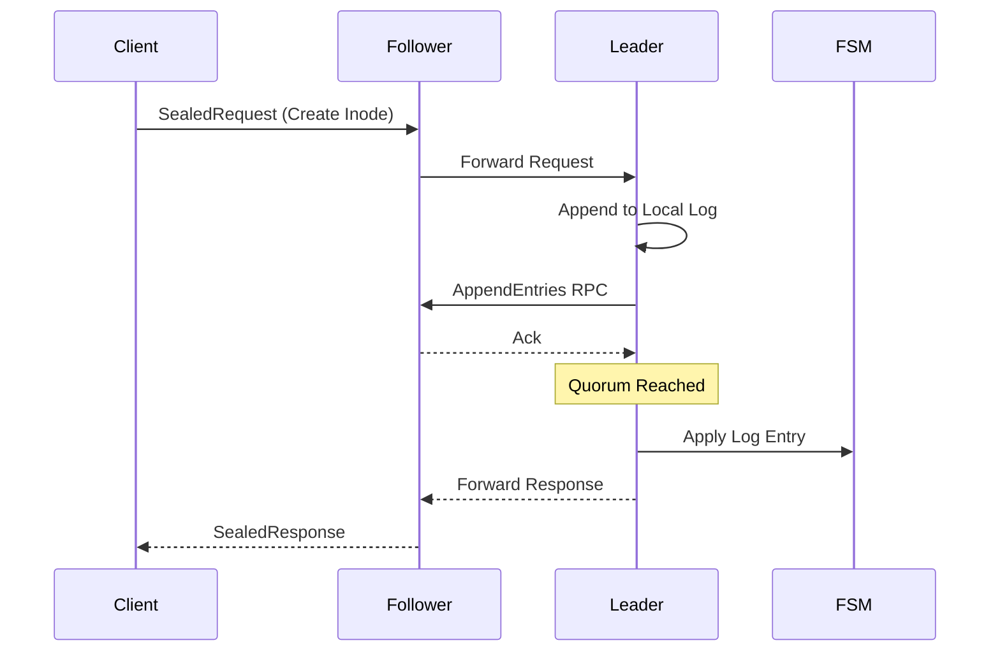
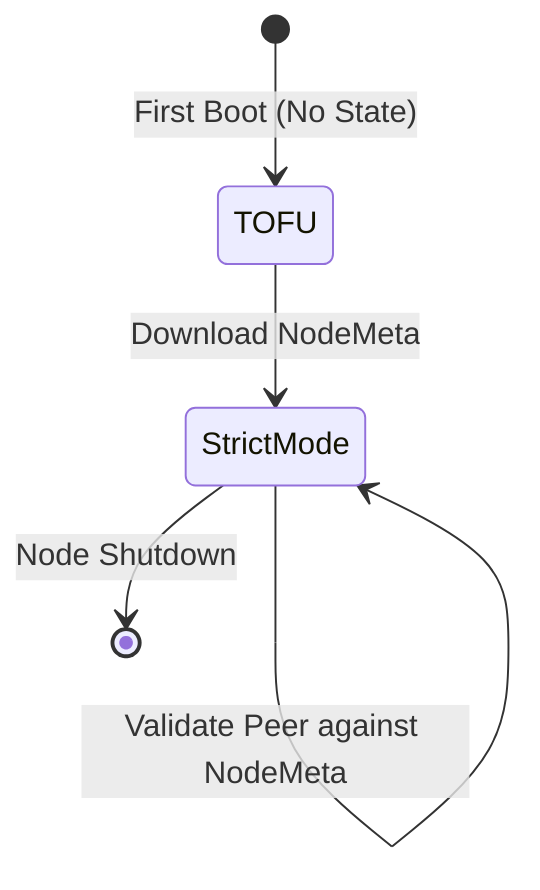

# DistFS Raft Consensus & Cluster Security

This document provides an analysis of the DistFS metadata layer. It details the consensus mechanics, the security posture of the cluster, mutual TLS (mTLS) infrastructure, and the two-tiered trust model utilized for Finite State Machine (FSM) encryption.

## 1. Consensus Mechanics

DistFS relies on the Raft consensus algorithm to manage the global file system namespace and metadata. The implementation prioritizes strong consistency (linearizability) for metadata mutations.

### 1.1 Leader Election and Log Replication

The cluster consists of $N$ MetaNodes (typically $N \in \{3, 5\}$). All metadata mutations must be routed to the elected Leader.

1.  **Election:** Nodes utilize randomized election timeouts. If a Follower receives no heartbeats from the Leader within the timeout window, it transitions to the Candidate state and requests votes. A Candidate becomes the Leader upon receiving a quorum ($\lfloor N/2 \rfloor + 1$) of votes.
2.  **Replication:** A client submitting a metadata mutation (e.g., creating an Inode) sends a `SealedRequest` to the cluster. If received by a Follower, the request is internally forwarded to the Leader.
3.  **Commitment:** The Leader appends the mutation to its local Raft log and broadcasts `AppendEntries` RPCs to all Followers. Once a quorum of nodes acknowledges the append, the Leader applies the mutation to its FSM and returns a success response to the client.

## 2. Cluster Security & mTLS

DistFS assumes the network is fundamentally hostile. All inter-node communication is secured via mutual TLS (mTLS), ensuring both confidentiality and strict peer authentication.

### 2.1 Node Identity

Each node possesses a unique, persistent identity rooted in an asymmetric key pair.
*   **Software Key:** By default, nodes generate an Ed25519 key pair (`node.key`).
*   **Hardware Key (TPM):** If instantiated with `--use-tpm`, the node generates an ECC P-256 key within a Trusted Platform Module. The private key material never leaves the TPM boundary.
*   **Node ID:** The Raft `NodeID` is derived deterministically from the public key, preventing ID spoofing.

### 2.2 Trust On First Use (TOFU) Bootstrapping

To bootstrap a secure cluster without a central Certificate Authority (CA), DistFS employs a strict Trust On First Use (TOFU) protocol.

1.  **Initial State:** A completely fresh node (no local Raft state) starts in TOFU mode.
2.  **Handshake:** The node connects to the cluster join address (the anticipated Leader). During the TLS handshake, it presents its self-signed certificate.
3.  **Trust Acquisition:** Because it is in TOFU mode, the joining node temporarily suspends peer certificate verification. Upon successful connection, it downloads the authoritative `NodeMeta` list—the set of trusted public keys for the entire cluster—from the Leader.
4.  **Strict Enforcement:** Once the `NodeMeta` is persisted locally, the node immediately and permanently transitions to **Strict Mode**. All future TLS connections require the peer to present a certificate matching a public key in the `NodeMeta` list.

## 3. Two-Tiered Trust Model for FSM Encryption

A critical challenge in encrypted distributed systems is resolving the circular dependency between Raft log application (which requires decryption keys) and cluster state (where the keys are stored). DistFS solves this using a two-tiered trust architecture.

### 3.1 Tier 1: Local Node Vault & ClusterSecret

At cluster initialization, the first node generates a high-entropy `ClusterSecret`. This secret is the root of trust for the cluster.
*   The `ClusterSecret` is encrypted using the node's local `MasterKey` (derived from `DISTFS_MASTER_KEY` or the TPM) and stored in a local, on-disk vault.
*   When a new node successfully completes the TOFU join process, the Leader securely transmits the `ClusterSecret` via the mTLS channel. The joining node persists this secret in its own local vault.

### 3.2 Tier 2: FSM KeyRing & The System Bucket

The Raft FSM is implemented using BoltDB. The FSM data is encrypted at rest, but the keys to decrypt it are stored *within* the FSM itself.
*   **The System Bucket:** The BoltDB `system` bucket contains the `FSM KeyRing` (a rotating set of AES-GCM keys) and the `ClusterSignKey`.
*   **Root Encryption:** Data within the `system` bucket is encrypted using a symmetric key deterministically derived from the **Tier 1 `ClusterSecret`**.
*   **Payload Encryption:** All other buckets (Inodes, Users, Groups) are encrypted using the active key from the **Tier 2 `FSM KeyRing`**.

This design ensures that a node can always decrypt the FSM root (using its local vault) to retrieve the active KeyRing required to process incoming Raft logs.

## 4. Snapshotting

To prevent unbounded Raft log growth, DistFS employs periodic snapshotting. DistFS utilizes a streaming BoltDB snapshot strategy (`MetadataSnapshot`).

### 4.1 Snapshot Portability

Because the FSM is fully encrypted, BoltDB snapshots can be safely transferred between nodes over the mTLS Raft transport.
*   When a Follower receives a snapshot, it replaces its local BoltDB file.
*   Because the Follower already possesses the `ClusterSecret` in its local Tier 1 vault, it can immediately decrypt the `system` bucket within the new snapshot, extract the current `FSM KeyRing`, and resume processing logs without requiring an out-of-band key exchange.

## 5. Cryptography Proof for Cluster Trust & Secret Distribution

The cluster trust model ensures that only authorized nodes can participate in consensus and that the `ClusterSecret` remains confidential to the cluster members.

### 5.1 Definitions

Let $\mathcal{N}$ be the set of nodes in the cluster.
Let $PK_n$ and $SK_n$ be the persistent asymmetric keypair for node $n \in \mathcal{N}$.
Let $\mathcal{M}$ be the `NodeMeta` list, which is the set of public keys $\{PK_1, PK_2, \dots, PK_k\}$ of currently trusted nodes.
Let $S$ be the `ClusterSecret`.

### 5.2 Theorem 3: Security of the TOFU Join Protocol

**Theorem 3:** If the underlying TLS implementation provides a secure, authenticated channel, and the signature scheme used for node identity is EUF-CMA secure, then the DistFS TOFU protocol is secure against Man-in-the-Middle (MITM) attacks after the initial trust acquisition.

**Proof (Sketch):**
The TOFU protocol has two phases: **Phase A (Trust Acquisition)** and **Phase B (Strict Enforcement)**.

1.  **Phase A:** A joining node $n_{new}$ connects to an existing node $n_{leader}$ over TLS. During the initial handshake, $n_{new}$ has no prior knowledge of $\mathcal{M}$. However, $n_{leader}$ authenticates $n_{new}$ by checking its self-signed certificate against a pre-authorized join request or administrator approval.
2.  **Secret Transmission:** Once authenticated, $n_{leader}$ transmits $S$ and $\mathcal{M}$ to $n_{new}$ over the encrypted TLS channel.
3.  **Phase B:** Node $n_{new}$ transitions to **Strict Mode**. It now refuses any TLS handshake where the peer's public key $PK_{peer} \notin \mathcal{M}$.

**Integrity Argument:** An adversary $\mathcal{A}$ attempting to impersonate a cluster member to $n_{new}$ after Phase A must present a certificate for some $PK_a \in \mathcal{M}$. Since $PK_a$ corresponds to a legitimate node $n_a$, $\mathcal{A}$ must also possess $SK_a$ to complete the TLS handshake. By the EUF-CMA security of the underlying identity keys, the probability of $\mathcal{A}$ possessing $SK_a$ or forging a valid signature for $PK_a$ is negligible. Thus, after the first secure connection, the cluster forms a closed, authenticated network.

### 5.3 Theorem 4: Confidentiality of the FSM Root

**Theorem 4:** Assuming the AES-GCM encryption scheme provides semantic security (IND-CPA) and the Tier 1 `ClusterSecret` $S$ is kept confidential, the contents of the FSM remain confidential even if the storage medium (BoltDB file) is exfiltrated.

**Proof (Sketch):**
1.  **Encryption Hierarchy:** The FSM data $D$ is encrypted as $C = E_{K_{fsm}}(D)$, where $K_{fsm}$ is a key from the `FSM KeyRing`.
2.  **Root of Trust:** $K_{fsm}$ is stored in the `system` bucket, encrypted as $C_{sys} = E_{f(S)}(K_{fsm})$, where $f$ is a key derivation function and $S$ is the `ClusterSecret`.
3.  **Confidentiality Chain:** To obtain plaintext $D$, an adversary must first obtain $K_{fsm}$ from $C_{sys}$. To decrypt $C_{sys}$, the adversary must possess $S$.
4.  **Local Protection:** On each node $n$, $S$ is stored as $C_s = E_{K_{master}}(S)$. $K_{master}$ is bound to the node's local hardware (TPM) or a secure environment variable.

If $S$ is only transmitted over mTLS channels (protected by Theorem 3) and only stored in encrypted vaults, then an adversary who only possesses the FSM file $C$ cannot derive $K_{fsm}$ without breaking the IND-CPA security of AES-GCM or compromising a node's local vault. Therefore, FSM confidentiality is preserved.